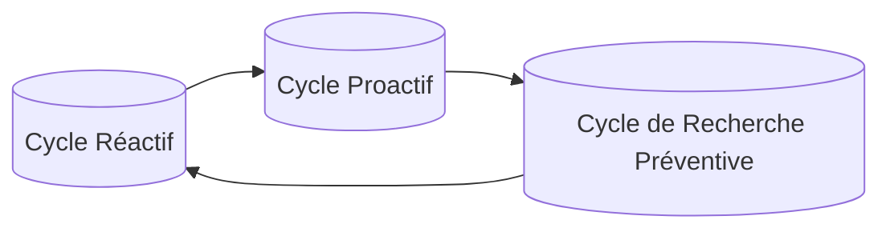

# 2. Vision DOSER : un nouveau paradigme

DOSER est une philosophie intégrée de gestion de la sécurité routière, portée par l’écosystème technologique DITROS (Digital Technologies for Road Safety). Elle dépasse la simple collecte de données pour devenir un **système socio-technique** aligné sur les meilleures pratiques internationales.

## 2.1 Une vision d’intégration et de conformité

- **Briser les silos** entre forces de l’ordre, services de santé, assurances, opérateurs de transport, ministères et citoyens.
- **Conformité** : alignement natif sur les recommandations de l’OMS, de l’AIPCR et sur la norme ISO 39001:2012.
- **Langage commun** : adopter des standards universels pour faciliter les partenariats et les financements (Banque mondiale, bailleurs).
- **Approche preuve & gouvernance** : assurer la traçabilité, la transparence et la redevabilité des politiques publiques.

!!! tip "Une plateforme nationale, une crédibilité internationale"
    En adoptant un système conforme aux normes globales, les gouvernements démontrent leur sérieux et renforcent la confiance des partenaires.

## 2.2 Le triple cycle d’intervention

DOSER transforme la donnée en action à travers un **triple cycle** :

1. **Réactif**  
   - Gestion immédiate de l’accident (alerte, prise en charge, documentation).  
   - Applications mobile & web pour capter des données précises et multimédia.

2. **Proactif**  
   - Analyse des données consolidées pour identifier points noirs et facteurs de risque.  
   - Tableaux de bord, cartographie SIG, suivi des comportements.

3. **Recherche préventive**  
   - Exploitation Big Data & IA pour simuler des scénarios, anticiper les risques et recommander des actions ciblées.  
   - Orientation des investissements et des politiques sur le long terme.

!!! note "De la réaction à la prévention"
    En bouclant ces trois cycles, DOSER transforme la donnée en un **actif stratégique** pour piloter la sécurité routière.

## 2.3 DOSER au cœur de DITROS

Dans l’écosystème DITROS, DOSER occupe une position centrale :

- **Cœur analytique** : fédère les informations issues des autres modules (routes, véhicules, usagers, post-accident).
- **Pivot informationnel** : distribue les insights aux décideurs, opérateurs et citoyens.
- **Catalyseur d’adoption** : l’intégration native crée des synergies incitant à déployer l’ensemble de la suite.

### Synergies clés

- Croiser les données d’infrastructure (GEOROUTE) avec les constats pour identifier les facteurs infrastructurels.
- Lier historique de contrôle technique (SEVITEV) et incidents pour anticiper les défauts véhicules.
- Exploiter les données comportementales (VIGIROUTE) pour cibler les campagnes de sensibilisation.

## 2.4 Une plateforme cloud-native résiliente

- **Microservices** orchestrés par Kubernetes pour la scalabilité et la maintenabilité.
- **Load balancing** pour la haute disponibilité et l’absorption des pics d’usage.
- **PostgreSQL + PostGIS** pour gérer les dimensions relationnelles et géospatiales.
- **Sécurité by design** : gouvernance des accès, audits, journaux d’activité.

DOSER est conçu pour répondre aux besoins présents tout en restant adaptable aux défis futurs.

